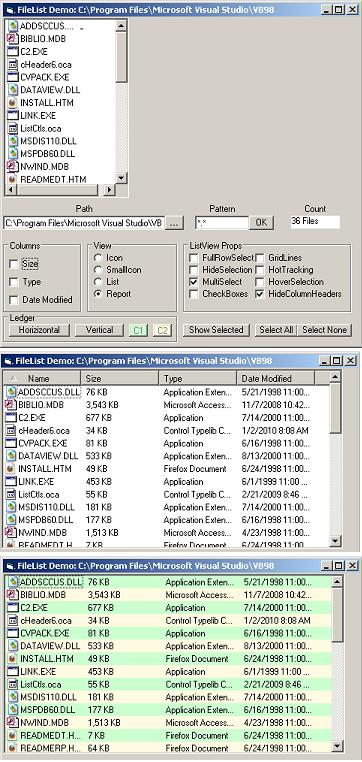



## ListView As FileListBox

### Description

A replacement for the antiquated FileListBox. This control sets the ListView's

imagelist to the system imagelist which alleviates the need for an ImageList

control to store file icons and is therefore less resource intensive. It is

subclassed so that the LV doesn't remove the system imagelist assignment.

Some other improvements over my previous submission: 1) Allows user to

remove the Size, Type, Date columns if desired, plus hide the columnheaders

in Report mode--this makes it look like the FileListBox with icons.

2) Added Horizontal and Vertical ledger styles (see screenshot) with the

option to change the colors. 3) Column header sort icons. Enjoy.
 
### More Info
 

             |
---                |---
**Submitted On**   |2010-01-16 11:05:38
**By**             |[Norm Cook](https://github.com/Planet-Source-Code/PSCIndex/blob/master/ByAuthor/norm-cook.md)
**Level**          |Advanced
**User Rating**    |4.8 (43 globes from 9 users)
**Compatibility**  |VB 6\.0
**Category**       |[Custom Controls/ Forms/  Menus](https://github.com/Planet-Source-Code/PSCIndex/blob/master/ByCategory/custom-controls-forms-menus__1-4.md)
**World**          |[Visual Basic](https://github.com/Planet-Source-Code/PSCIndex/blob/master/ByWorld/visual-basic.md)
**Archive File**   |[ListView\_A2172941162010\.zip](https://github.com/Planet-Source-Code/norm-cook-listview-as-filelistbox__1-72843/archive/master.zip)

